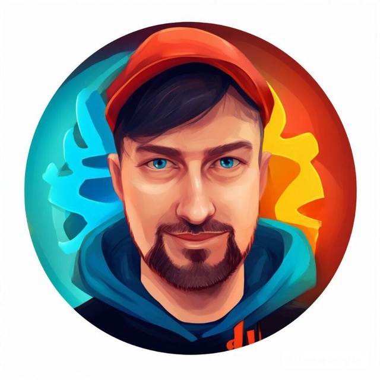

# Лощинин Максим


## Мои контакты
[Моя электронная почта](maximrus62@gmail.com)
[Мой телеграм аккаунт](@MaximRus91)

## Коротко о себе
>Я начинаю изучать Frontend разработку. Мне эта сфера очень интересна.

>Всё своё свободное время я уделяю для обучения. Помимо обучения хочу начать вести образователбный блог по Frontend разработке.
>Хочу создать бесплатный обучающий ресурс в интернете. Это будет полезно для новичков и даст мне хороший бонус для закрепления практики.

## Мои цели
- Пройти обучение в RS School
- Начать делать свои образовательные материалы
- Создать учебную платформу
- Заполнить своё портфолио разнообразными проектами
- Найти работу Frontend специалистом

## Мои навыки
- Command line
- Environment setting
- Git/GitHub
- HTML
- CSS
- Basic JavaScript

## Мои проекты
[CV](https://maxim-l91.github.io/rsschool/cv)

## Мои положительные качества
> [!NOTE]
> Я ответсвенный человек, который горит своим делом. Для меня важно не просто выполнить задачу, а сделать её максимально качественно

## Моё первое решение задачи на codewars
```javascript
function hoopCount(n) {
  if (n >= 10) {
    return "Great, now move on to tricks";
  } else {
    return "Keep at it until you get it";
  }
}
```
